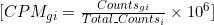

# Gene expression units and calculations

Counts per million (CPM) is a normalization method commonly used in genomics and transcriptomics to account for differences in sequencing depth or library size when comparing gene expression levels across samples.

Here's how CPM is calculated:

1. **Total Counts**: First, calculate the total number of sequencing reads (or counts) for each sample. This represents the library size or sequencing depth of each sample.

2. **Normalization**: Divide the count of each gene by the total count for the corresponding sample.

3. **Scaling**: Multiply the result by a million to scale the counts to a common reference point, allowing for comparison between samples.

The formula for calculating CPM for a specific gene \( g \) in a sample \( i \) is:

Where:
- \( CPM_{gi} \) is the counts per million for gene \( g \) in sample \( i \).
- \( Counts_{gi} \) is the count of gene \( g \) in sample \( i \).
- \( Total\_Counts_i \) is the total count of all genes in sample \( i \).

Counts per million normalization allows for the comparison of gene expression levels between samples, accounting for differences in sequencing depth or library size. This normalization method is particularly useful in RNA-seq experiments, where the number of reads mapped to each gene can vary significantly between samples due to technical factors or biological variability.
